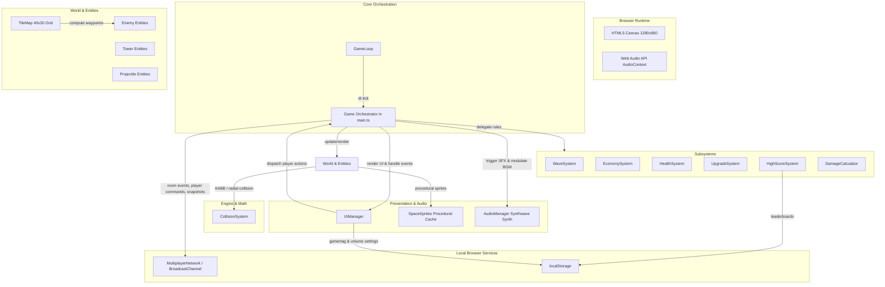
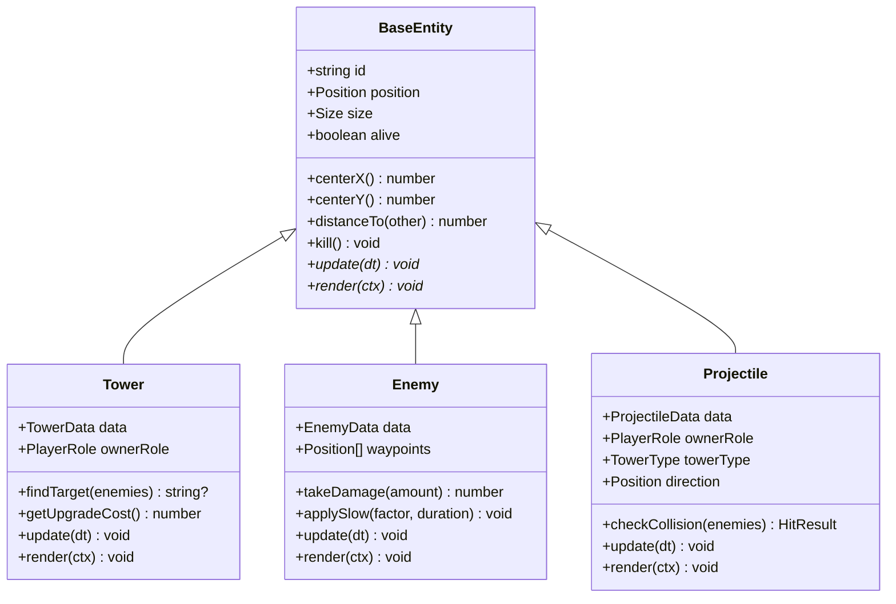
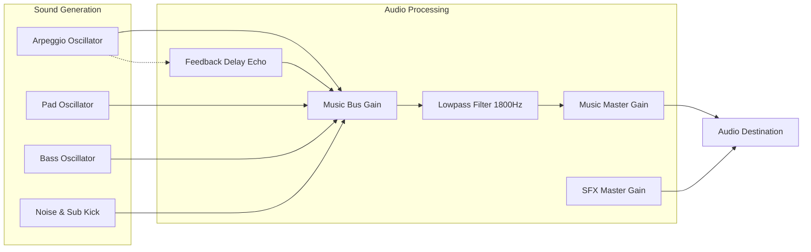
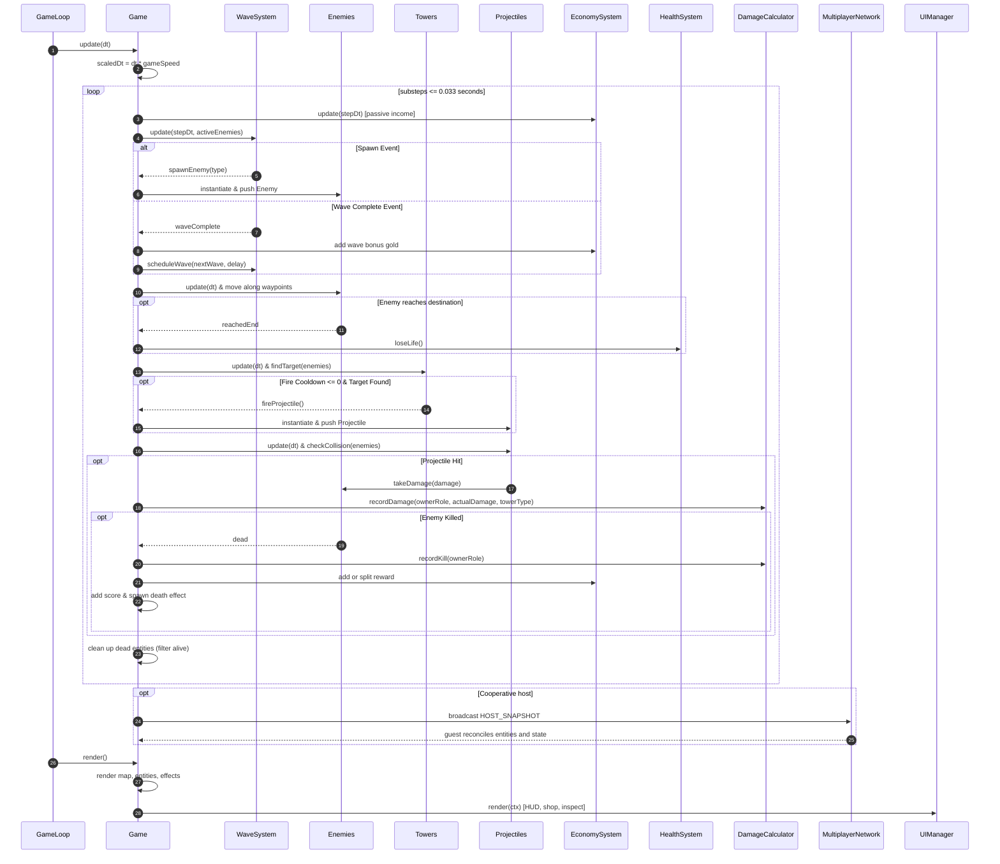
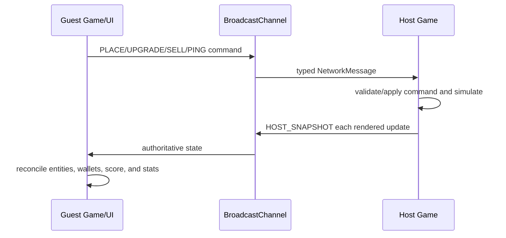

# Architecture Documentation

## 1. Overview

**AI Tower Defence** is a modular, client-side tower defence game built with TypeScript, HTML5 2D Canvas, Vite, and the Web Audio API. It supports solo play and two-player cooperative play between browser contexts, fixed-waypoint enemy navigation, projectile combat, multi-tier tower upgrades, per-map persisted leaderboards, variable simulation speed, procedural synthwave music, cached procedural pixel art, and an immediate-mode UI rendered entirely on canvas.



---

## 2. Technology Stack & Key Architectural Principles

- **Language & Runtime:** TypeScript (strict type checking enabled in [tsconfig.json](../tsconfig.json)), ES modules.
- **Build & Development Tooling:** Vite for near-instant hot reloading and optimized rollup-based static production bundles.
- **Rendering Engine:** Native HTML5 2D Canvas API ($1280 \times 960$ fixed logical resolution).
- **Audio Engine:** Web Audio API procedural synthesis with custom subtractive oscillators, envelope shaping, noise buffers, and tempo-synced feedback delay lines.
- **Testing Framework:** Playwright for automated headless and headed end-to-end browser tests.

### Architectural Principles

1. **Decoupled System Responsibilities:** Game rules (waves, economy, player health, upgrade formulas) are separated into specialized, testable system classes rather than monolithic state scripts.
2. **Bounded Variable-Speed Simulation:** The animation loop clamps real elapsed time to $0.1\text{s}$. `Game` then applies the selected $1\times$, $2\times$, $3\times$, or $5\times$ speed and subdivides simulation work into steps no larger than $0.033\text{s}$.
3. **Procedural Vector Sprite Generation & Offscreen Caching:** Visual assets are generated dynamically using native canvas drawing paths and cached onto offscreen canvas buffers (`Map<string, HTMLCanvasElement>`) to maximize runtime framerates.
4. **Immediate-Mode Canvas UI:** The user interface (HUD, toolbars, modal dialogs, interactive sliders, tower inspectors) is rendered directly in the game's render loop, using event listeners mapped to canvas logical coordinates.
5. **System-Owned State:** [EconomySystem](../src/system/EconomySystem.ts), [HealthSystem](../src/system/HealthSystem.ts), [HighScoreSystem](../src/system/HighScoreSystem.ts), and [DamageCalculator](../src/system/DamageCalculator.ts) own their respective state. `Game` projects that state into the canvas UI and live test hooks.
6. **Host-Authoritative Cooperative Play:** Player commands are exchanged through `BroadcastChannel`, while player 1 runs combat and periodically publishes complete entity/economy/stat snapshots. Player 2 reconciles those snapshots and does not run a competing simulation.
7. **Browser-Local Persistence and Networking:** Scores, gamertags, and audio settings use `localStorage`; room discovery and gameplay messages use `BroadcastChannel`. There is no remote server, account service, or cross-device transport.

---

## 3. Core Architectural Subsystems

### 3.1. Main Orchestration (`Game`)

Located in [src/main.ts](../src/main.ts), the `Game` class acts as the central coordinator:
- Owns [GameLoop](../src/engine/GameLoop.ts), [TileMap](../src/map/TileMap.ts), [UIManager](../src/ui/UIManager.ts), [AudioManager](../src/audio/AudioManager.ts), [MultiplayerNetwork](../src/network/MultiplayerNetwork.ts), and all rule systems.
- Manages the primary game state machine: `'menu'`, `'playing'`, `'paused'`, `'waveComplete'`, and `'gameOver'`.
- Selects solo or multiplayer orchestration, applies game speed, and runs fixed-size simulation substeps.
- Runs the top-level tick orchestration (`update(dt)` and `render()`).
- Coordinates entity creation, firing projectiles, handling damage resolution, cleaning up dead entities, and awarding gold/score.
- In multiplayer, applies remote player commands, owns host snapshots, and reconciles guest state.
- Exposes window-level test hooks (`game`, `gameData`, `uiManager`, `highScoreSystem`, `damageCalculator`, `network`, and `SpaceSprites`) for Playwright suites.

---

### 3.2. Engine Layer

- **[GameLoop](../src/engine/GameLoop.ts):**
  - Manages `requestAnimationFrame` lifecycle.
  - Computes $\Delta t = \min((t_{\text{current}} - t_{\text{last}})/1000, 0.1)$.
  - Executes decoupled `update(dt)` and `render()` callbacks.
- **[CollisionSystem](../src/engine/CollisionSystem.ts):**
  - Static mathematical and geometric utility library.
  - Methods:
    - `checkOverlap(a, b)`: Axis-Aligned Bounding Box (AABB) intersection.
    - `pointInCircle(point, center, radius)`: Euclidean squared-distance point containment check.
    - `circlesOverlap(a, b)`: Radial bounding circle collision detection.
    - `distance(a, b)`: Euclidean distance calculation $\sqrt{(x_2 - x_1)^2 + (y_2 - y_1)^2}$.

---

### 3.3. Entity Hierarchy

All active world elements inherit from the abstract base class [BaseEntity](../src/entities/BaseEntity.ts):



#### Entity Details

- **[Tower](../src/entities/Tower.ts):**
  - Configured by tower type: `'archer'`, `'cannon'`, `'sniper'`, `'ice'`, `'flamethrower'`.
  - Maintains firing cooldown, targeting logic (closest enemy within radius), and level ($1$ to $5$).
  - Evaluates upgrade cost: $\lfloor \text{cost} \times (0.5 + \text{level} \times 0.3) \rfloor$.
  - Carries optional owner role/tag metadata in cooperative games; only the owner can upgrade or sell it.
  - Dispatches rendering to [SpaceSprites](../src/visuals/SpaceSprites.ts) with level-tier visual progression and animated barrels/cooling vents.
- **[Enemy](../src/entities/Enemy.ts):**
  - Configured by enemy archetype: `'normal'`, `'speed'`, `'armored'`, `'regenerating'`, `'boss'`.
  - Follows tilemap waypoints using vector interpolation.
  - Supports armor mitigation ($\text{damage} - \text{armor}$), health regeneration per second, and temporary slow modifiers.
  - Scales hit points based on wave number and difficulty mode.
- **[Projectile](../src/entities/Projectile.ts):**
  - Configured by projectile archetype: `'arrow'`, `'cannonball'`, `'laser'`, `'ice'`, `'flame'`.
  - Travels along normalized directional unit vectors.
  - Carries payload metadata: single-target damage, area-of-effect splash radius, and slow parameters.
  - Propagates tower owner and tower type so damage and kills can be attributed to the correct player.
  - Automatically kills itself when moving out of world bounds or striking targets.

---

### 3.4. Game Systems (`src/system/`)

| System | File | Key Responsibilities |
|---|---|---|
| **EconomySystem** | [src/system/EconomySystem.ts](../src/system/EconomySystem.ts) | Owns the solo wallet or independent P1/P2 wallets. Cooperative rewards are split evenly, odd remainders alternate between players, and each 10-second passive-income payment is split $5/5$. |
| **HealthSystem** | [src/system/HealthSystem.ts](../src/system/HealthSystem.ts) | Tracks the shared life pool (default: 20), decrements lives when enemies reach the exit waypoint, and reports game-over state. |
| **UpgradeSystem** | [src/system/UpgradeSystem.ts](../src/system/UpgradeSystem.ts) | Computes contextual upgrade paths, stat scaling up to level 5, and tower sell refunds. |
| **WaveSystem** | [src/system/WaveSystem.ts](../src/system/WaveSystem.ts) | Uses a seedable linear congruential PRNG to generate wave rosters, schedules inter-wave pauses, streams spawns, handles every-fifth-wave bosses, and emits completion signals. |
| **HighScoreSystem** | [src/system/HighScoreSystem.ts](../src/system/HighScoreSystem.ts) | Validates and persists the top 10 entries for each map under `td_highscores`, including score, wave, difficulty, and timestamp. |
| **DamageCalculator** | [src/system/DamageCalculator.ts](../src/system/DamageCalculator.ts) | Tracks per-player total/wave damage, kills, tower-type breakdowns, contribution percentages, and the current wave leader. |

---

### 3.5. Cooperative Multiplayer (`MultiplayerNetwork`)

[MultiplayerNetwork](../src/network/MultiplayerNetwork.ts) wraps the browser `BroadcastChannel` API using the `td_multiplayer_channel` channel:
- Hosts announce rooms; guests query or join by room code; both players ready before a host-driven launch countdown.
- Placement, upgrade, sell, wave-start, pause, speed, cursor, and tile-ping commands are broadcast as typed `NetworkMessage` values.
- P1 is authoritative for waves, enemies, projectiles, collision, health, score, wallets, and combat statistics.
- After each host update, a `HOST_SNAPSHOT` publishes those values plus entity snapshots. P2 creates or updates local render entities by stable IDs and does not advance combat locally.
- A shared seed makes host-generated cooperative wave configurations reproducible; the host also includes each generated configuration in `START_WAVE` messages.

This transport is intentionally limited to browsing contexts on the same origin/device. It does not provide internet matchmaking, durable rooms, authentication, reconnection, or adversarial validation.

---

### 3.6. World & Map Representation (`TileMap`)

Located in [src/map/TileMap.ts](../src/map/TileMap.ts):
- Manages a $40 \times 30$ tile grid ($1280 \times 960$ px total, $32 \times 32$ px per tile).
- Supports three distinct map environments:
  1. **Space Station (`space`):** Orbital conduits with a serpentine path across galactic starfields.
  2. **Dungeon Catacombs (`dungeon`):** Subterranean crypt switchbacks with stone walls and lava pits.
  3. **Military Outpost (`military`):** Fortified perimeter run with razor fencing and sandbag roadblocks.
- Automatically calculates directional waypoints from the grid layout for enemy path traversal.
- Computes 4-bit bitmask connectivity ($N=1, E=2, S=4, W=8$) for path auto-tiling.
- Enforces placement rules (`isBuildable(col, row)`) to prevent towers from blocking enemy paths or hazards.

---

### 3.7. Visual Presentation & Procedural Sprites (`SpaceSprites`)

Located in [src/visuals/SpaceSprites.ts](../src/visuals/SpaceSprites.ts):
- Eliminates external static image dependencies by drawing high-definition pixel-art vector sprites procedurally using Canvas 2D primitives.
- **Sprite Caching Architecture:**
  - Offscreen canvas caches indexed by unique composite keys (`mapType:tileType:variant:mask`, `towerType:level`, `projectileType:level`).
  - Cache hits render via fast `ctx.drawImage` blits.
- **Visual Features:**
  - Dynamic scrolling parallax backdrops (starfields with nebulas, brickwork, military camouflage).
  - Multi-tier visual evolutions for towers across levels 1 through 5 (reinforced plates, dual barrels, plasma cooling coils, rotating energy orbs).
  - Weapon-specific projectile trails and particle glow halos.
  - Floating damage/gold text indicators and animated explosion/hit effects.

---

### 3.8. User Interface (`UIManager`)

Located in [src/ui/UIManager.ts](../src/ui/UIManager.ts):
- Renders an immediate-mode GUI layered above the gameplay canvas:
  - **Top Bar (HUD):** Wave, shared lives, local gold, score, game-speed control, leaderboard access, settings, and cooperative contribution indicators.
  - **Bottom Bar (Action Dock):** Tower purchase shop with cost badges, lock state badges (e.g. Flamethrower unlocking at wave 25), and quick hotkeys (`1`-`5`).
  - **Tower Inspector Card:** Displays selected tower details, stats, upgrade preview badges (`DMG +2.0`, `SPLASH +30%`), upgrade cost buttons, and sell refund actions.
  - **Interactive Overlays:** Gamertag entry, solo/multiplayer mode selection, room create/browse/waiting screens, difficulty and map selection, pause/game-over screens, high-score entry, per-map leaderboards, combat statistics, settings, and help.
- Cooperative affordances include ownership accents, remote cursor display, shift-click tile pings, ready states, launch countdown, and separate wallet/stat readouts.
- Handles coordinate transformations from viewport client coordinates to logical canvas space.

---

### 3.9. Audio Engine & Dynamic Synthwave Synthesizer (`AudioManager`)

Located in [src/audio/AudioManager.ts](../src/audio/AudioManager.ts):
- **Web Audio Signal Chain:**



- **Procedural BGM:**
  - Synthesizes 16-step bar chord progressions with arpeggiation patterns in real time.
  - Adapts arrangement intensity to wave tiers ($1\text{--}4$ ambient, $5\text{--}9$ rhythmic, $10\text{--}19$ driving synthwave, $20+$ intense double-time drums).
  - Boss wave arrangements feature accelerated tempo ($0.11\text{s}$ step duration) and heavy sawtooth basslines.
- **Sound Effects (SFX):**
  - Procedurally synthesizes sound effects for laser pulses, cannon thuds, ice crystal snaps, flame bursts, enemy deaths, coin rewards, wave horns, and UI clicks.
- **Volume Controls & Persistence:**
  - Separate gain buses for music and SFX with settings persisted to browser `localStorage`.

---

## 4. Game Loop & Data Flow

`GameLoop` supplies clamped wall-clock time. For the authoritative simulation, `Game` multiplies that value by the selected speed and repeatedly calls `updateSimulation` with at most $0.033\text{s}$ per call. This keeps high-speed movement and collision checks bounded. Pause stops simulation updates; changing speed does not change rendering cadence. In cooperative play, only P1 enters this simulation path.



### Cooperative Command and State Flow



---

## 5. Wave & Difficulty Scaling Formulas

### Enemy HP Multipliers
- **Base Wave HP Multiplier:**
  $$\text{Multiplier}_{\text{wave}} = 1 + (\text{Wave} - 1) \times 0.15$$
- **Difficulty Multiplier:**
  - Easy: $1.0\times$
  - Medium: $2.0\times$
  - Hard: $3.0\times$
- **Total HP:**
  $$\text{HP}_{\text{actual}} = \text{BaseHP} \times \text{Multiplier}_{\text{wave}} \times \text{Multiplier}_{\text{difficulty}}$$

### Wave Size & Spawn Frequency
- **Enemy Count per Wave:** $\lfloor 5 + \text{Wave} \times 1.5 \rfloor$
- **Spawn Interval:** $\max(0.3\text{s}, 1.0\text{s} - \text{Wave} \times 0.02\text{s})$
- **Boss Spawn:** Occurs every 5th wave ($5, 10, 15, \dots$).

---

## 6. Directory Structure & File Map

```
ai-towerdefence/
├── docs/
│   ├── architecture.md                     # System architecture and technical design
│   ├── features/                           # Feature specifications
│   │   ├── dynamic-synthwave-bgm.md
│   │   ├── persisted-map-high-scores.md
│   │   ├── selectable-map-types.md
│   │   ├── tower-upgrade-visuals.md
│   │   ├── variable-game-speed-controls.md
│   │   ├── cooperative-multiplayer.md
│   │   └── multiplayer-damage-calculator.md
│   └── tasks/                              # Task breakdown and implementation tracking
├── src/
│   ├── main.ts                             # Main Game orchestrator and state coordinator
│   ├── types.ts                            # TypeScript domain models and interface types
│   ├── audio/
│   │   └── AudioManager.ts                 # Web Audio synthesis and dynamic BGM engine
│   ├── engine/
│   │   ├── CollisionSystem.ts              # AABB and radial collision detection
│   │   └── GameLoop.ts                     # Clamped delta-time animation loop
│   ├── entities/
│   │   ├── BaseEntity.ts                   # Abstract base entity class
│   │   ├── Enemy.ts                        # Enemy navigation, stats, and damage intake
│   │   ├── Projectile.ts                   # Projectile physics, homing, and splash payloads
│   │   └── Tower.ts                        # Tower targeting, cooldowns, and upgrade scaling
│   ├── map/
│   │   └── TileMap.ts                      # 40x30 tile layouts, auto-tiling, and waypoint generation
│   ├── network/
│   │   └── MultiplayerNetwork.ts           # BroadcastChannel rooms, commands, and state messages
│   ├── system/
│   │   ├── DamageCalculator.ts             # Per-player damage, kill, and contribution statistics
│   │   ├── EconomySystem.ts                # Gold wallet and periodic interest income
│   │   ├── HighScoreSystem.ts              # Per-map local leaderboard persistence
│   │   ├── HealthSystem.ts                 # Player life pool and game-over detection
│   │   ├── UpgradeSystem.ts                # Tower upgrade paths, archetype perks, and refunds
│   │   └── WaveSystem.ts                   # Wave generator, enemy queueing, and schedule timers
│   ├── ui/
│   │   └── UIManager.ts                    # Canvas HUD, tower shop, modals, and inspector
│   └── visuals/
│       └── SpaceSprites.ts                 # Procedural sprite generator and offscreen cache
├── tests/
│   ├── helpers/
│   │   └── game-page.ts                    # Playwright Page Object Model helper
│   └── ui/                                 # End-to-end UI and gameplay test suites
│       ├── canvas-rendering.spec.ts
│       ├── damage-calculator.spec.ts
│       ├── game-speed.spec.ts
│       ├── gameplay-controls.spec.ts
│       ├── leaderboards.spec.ts
│       ├── map-selection.spec.ts
│       ├── menu-and-navigation.spec.ts
│       ├── multiplayer.spec.ts
│       ├── tower-placement-economy.spec.ts
│       ├── tower-upgrade-sell.spec.ts
│       └── tower-upgrade-visuals.spec.ts
├── index.html                              # HTML5 Canvas container page
├── package.json                            # Scripts and dependencies
├── playwright.config.ts                    # Playwright test configuration
├── tsconfig.json                           # TypeScript compiler options
└── vite.config.ts                          # Vite bundler configuration
```

---

## 7. Quality Assurance & Automated Testing Architecture

The codebase incorporates end-to-end UI and gameplay validation via Playwright:
- **Test Page Object Model ([tests/helpers/game-page.ts](../tests/helpers/game-page.ts)):** Encapsulates canvas interactions, coordinates, menu clicks, tower placement, and window-state introspection.
- **Direct State Introspection:** Specs use the exposed `game`, `gameData`, `uiManager`, `highScoreSystem`, `damageCalculator`, `network`, and `SpaceSprites` hooks when logic assertions are more robust than pixel matching.
- **Feature Coverage:** Dedicated suites cover maps, speed controls, leaderboards, cooperative room/gameplay flows, damage attribution, economy, upgrades, navigation, and canvas rendering.
- **Canvas Pixel Validation:** Visual tests evaluate nonblank rendering and sprite differences for map/tower states where pixels are the behavior under test.
- **Build Gate:** `npm run build` runs strict TypeScript compilation before producing the Vite bundle.
