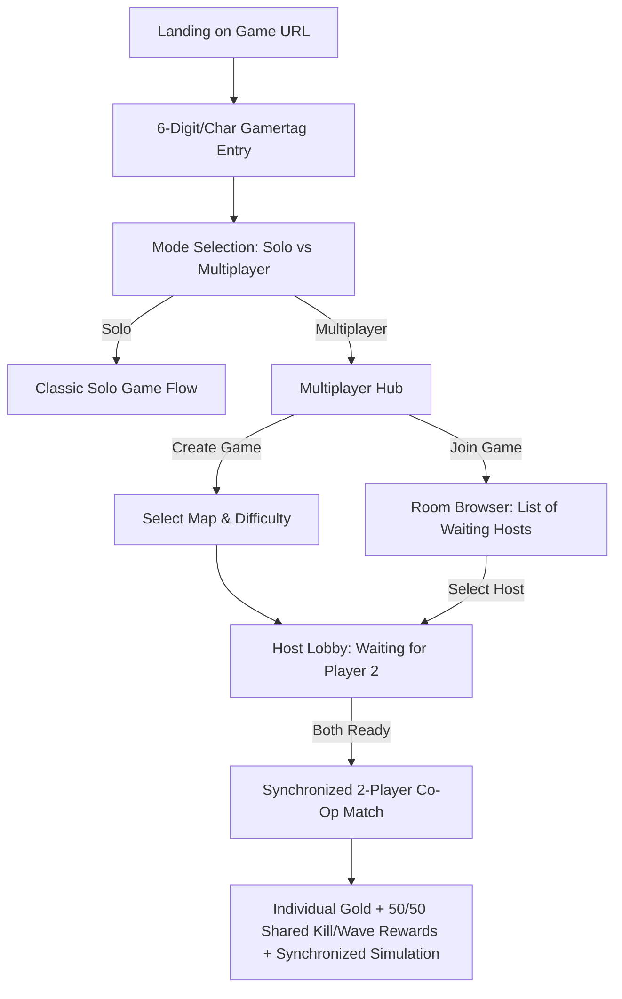
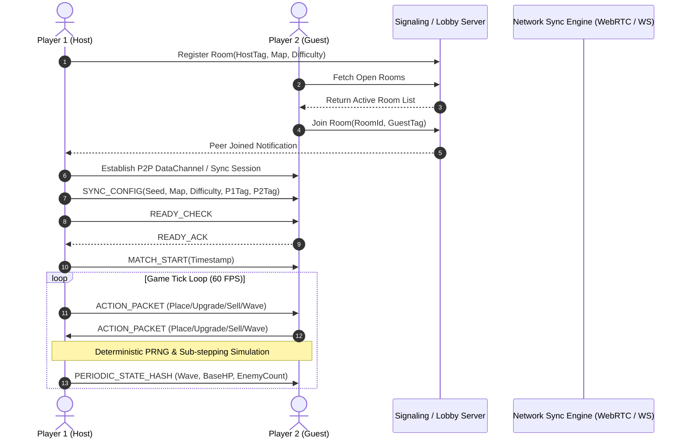

# Feature: Synchronized 2-Player Cooperative Multiplayer

## 1. Summary

Introduce real-time 2-player cooperative multiplayer to AI Tower Defence. Players entering the game are prompted for an arcade-style 6-character gamertag, after which they can choose between **Solo Play** (existing single-player experience) and **Multiplayer Co-Op**. In Multiplayer mode, players can **Create a Game** (specifying map and difficulty while waiting in a host lobby) or **Join a Game** (browsing active waiting rooms with host gamertag, map type, and difficulty listed). 

During co-op gameplay, both players defend the shared base together in real time on fully synchronized screens. Each player maintains their own gold reserves for purchasing and upgrading towers, while all rewards from enemy defeats and wave completions are split evenly between both players.



---

## 2. User Journey & Interface Flow

### 2.1. Initial Gamertag Landing Entry
- When any user visits the game URL, the game intercepts the landing view with a **Gamertag Entry Modal** before reaching the main menu.
- **Format:** Exact 6-character arcade slot style matching the leaderboard high score system (alphanumeric `A-Z`, `0-9`, auto-uppercased, padded or up to 6 chars).
- **Persistence:** Gamertag is saved in `localStorage` under `td_gamertag` so returning players have their tag prefilled and can immediately confirm or edit.
- **Validation:** Minimum 1 character, maximum 6 characters. Fallback to `P1` or random tag `PILOT1` if submitted blank.

### 2.2. Mode Selection: Solo vs Multiplayer
Once the gamertag is set, the player lands on the **Mode Selection Screen**:
- **SOLO MODE Button:** Launches the current standalone game menu (select map, select difficulty, start single-player game, view high scores).
- **MULTIPLAYER CO-OP Button:** Enters the Multiplayer Lobby Hub.
- Displays current active gamertag in the top corner with an **[EDIT]** button to change tags anytime.

### 2.3. Multiplayer Lobby Hub
The Multiplayer Hub offers two primary pathways:
1. **CREATE GAME (Host Pathway):**
   - Host chooses **Map Type** (`Space Station`, `Dungeon Catacombs`, `Military Outpost`).
   - Host chooses **Difficulty** (`Easy`, `Medium`, `Hard`).
   - Host clicks **CREATE LOBBY** and transitions to the **Waiting Room**:
     - Displays Room Code / Room ID (e.g. `#ROOM-4821`).
     - Shows Host Gamertag, Selected Map, and Selected Difficulty.
     - Status: *"Waiting for Player 2 to join..."* with animated radar / pulse indicator.
     - Options to **CANCEL / BACK** to lobby or **START GAME** once Player 2 connects.
2. **JOIN GAME (Room Browser Pathway):**
   - Displays a dynamic list of open public game rooms currently waiting for a partner.
   - **Room List Columns:**
     - **Host Gamertag** (e.g. `ACE999`, `NOVA01`)
     - **Map** (`Space`, `Dungeon`, `Military`)
     - **Difficulty** (`Easy`, `Medium`, `Hard`)
     - **Status / Ping** (`Waiting`, `Ready`)
     - **Action:** `JOIN` button.
   - Includes **REFRESH** button and optional direct **ENTER ROOM CODE** input box for private matches.
   - When the joining player clicks `JOIN`, they connect to the host's room.

### 2.4. Synchronized Match Launch
- Once both players are present in the room:
  - Both screens show: `Player 1 (Host): [Gamertag]` vs `Player 2 (Guest): [Gamertag]`.
  - Both players see a **READY** toggle button.
  - When both players are marked Ready, a 3-second synchronized countdown triggers: `3... 2... 1... LAUNCH!`.
  - Both clients initialize the same map, difficulty, and random number generator seed.

---

## 3. Cooperative Gameplay Mechanics & Rules

### 3.1. Economy & Resource Model (Split Resources)
- **Individual Gold Reserves:**
  - Player 1 and Player 2 each have their own independent gold balance (e.g. each starting with $400g on Easy or difficulty base).
  - Placing a tower deducts gold exclusively from the player who placed it.
  - Upgrading a tower deducts gold exclusively from the upgrading player.
  - Selling a tower refunds gold (70% standard) to the player who initiated the sale.
- **50/50 Shared Reward Splitting:**
  - **Enemy Kills:** When any tower kills an enemy (reward value $R$), the bounty is divided equally:
    $$\text{Reward}_{\text{P1}} = \lfloor R / 2 \rfloor, \quad \text{Reward}_{\text{P2}} = \lceil R / 2 \rceil$$
    *(Alternating leftover 1 gold across kills to maintain exact balance).*
  - **Wave Completion Bonuses:** Wave clear bonuses are split 50/50 between both players.
  - **Floating Gold Text:** Visual floating `+g` text on enemy death indicates split earnings (e.g. `+10g (Shared)`).

### 3.2. Shared World & Simultaneous Tower Placement
- **Shared 40x30 Tile Map:**
  - Both players see the identical map grid and path.
  - Either player can place towers on any buildable tile not currently occupied.
- **Player Ownership & Visual Identification:**
  - **Player 1 Towers:** Outlined / accented with Neon Cyan (`#00E5FF`).
  - **Player 2 Towers:** Outlined / accented with Neon Amber / Magenta (`#FFB300` / `#FF007F`).
  - Hovering / inspecting a tower displays: `Owner: [Gamertag] | Tier [N] [Type]`.
- **Collaborative Upgrades & Sales:**
  - By default, either player can select and inspect any tower on the field.
  - Upgrading an ally's tower is permitted (the upgrader pays the cost), encouraging cooperative team investment.

### 3.3. Shared Health, Waves, & Game Controls
- **Shared Base Health (Lives):**
  - The base has a single shared health pool (e.g. 20 HP). If an enemy breaches the exit portal, the shared base loses 1 HP for both players.
- **Wave Spawning & Controls:**
  - Wave countdown timer and enemy spawn sequence are synchronized.
  - Either player can click **START WAVE** or **NEXT WAVE** (with a brief "P1 started wave" notification banner).
- **Game Speed Synchronization:**
  - Speed toggles (`1X`, `2X`, `3X`, `5X`) send a speed change request packet; the match simulation speed updates synchronously on both clients.

---

## 4. Technical Architecture & Synchronization



### 4.1. Network Transport Layer
- **Signaling & Lobby Management:** Lightweight WebSocket signaling service or serverless WebRTC signaling for room creation, room listing, and peer discovery.
- **Peer-to-Peer Data Channel (WebRTC / WebSocket Relay):** Low-latency, ordered, reliable data channel for game actions and periodic checksum verification.

### 4.2. Deterministic Action Synchronization Model
- **Deterministic PRNG:** Both clients initialize the random number generator with a shared seed generated at match start. Enemy health variations, wave composition order, and targeting ties resolve identically on both machines.
- **Action Packet Protocol:**
  ```typescript
  export type NetworkMessage =
    | { type: 'ROOM_STATE'; host: string; guest?: string; map: MapType; difficulty: Difficulty }
    | { type: 'START_GAME'; seed: number; startTime: number }
    | { type: 'PLACE_TOWER'; playerId: string; towerType: TowerType; tileX: number; tileY: number; timestamp: number }
    | { type: 'UPGRADE_TOWER'; playerId: string; towerId: string; upgradeType: string; timestamp: number }
    | { type: 'SELL_TOWER'; playerId: string; towerId: string; timestamp: number }
    | { type: 'START_WAVE'; playerId: string; waveNumber: number }
    | { type: 'SET_GAME_SPEED'; playerId: string; speed: GameSpeed }
    | { type: 'PING_LOCATION'; playerId: string; tileX: number; tileY: number }
    | { type: 'SYNC_HASH'; frame: number; baseHealth: number; wave: number; p1Gold: number; p2Gold: number; entityCount: number };
  ```

### 4.3. HUD & Dual Economy Interface
- **Top Bar Redesign in Co-Op:**
  - Left: Base Lives (`❤️ 20`) | Wave (`WAVE 3/∞`) | Game Speed (`[2X]`).
  - Right: Dual Gold Meters:
    - `[P1] ACE999: 450g` (Cyan)
    - `[P2] NOVA01: 320g` (Amber)
- **Multiplayer Cursor / Ping Indicator:**
  - Shows remote player's mouse position or tactical ping markers on the grid to facilitate tactical coordination.

---

## 5. Implementation Task Breakdown

The multiplayer feature is split into 6 structured implementation tasks:

1. **[Task 26: Gamertag Landing Entry & Mode Selection Modal](docs/tasks/task-26-gamertag-entry-and-mode-selection.md)**
   - Initial 6-character gamertag input modal on URL landing with `localStorage` persistence.
   - Mode selection screen (`Solo` vs `Multiplayer Co-Op`).
2. **[Task 27: Multiplayer Lobby, Room Creation & Room Browser](docs/tasks/task-27-multiplayer-lobby-and-room-browser.md)**
   - Create Room interface (map and difficulty picker).
   - Join Room browser listing waiting hosts with map and difficulty.
   - Ready check and lobby countdown orchestration.
3. **[Task 28: Cooperative Split Economy & Dual Tower Ownership](docs/tasks/task-28-cooperative-split-economy-and-tower-ownership.md)**
   - Independent gold balances for Player 1 and Player 2.
   - 50/50 reward splitting for enemy kills and wave completion rewards.
   - Color-coded tower ownership visual indicators and upgrade permission models.
4. **[Task 29: Real-Time Network Synchronization & Deterministic Simulation](docs/tasks/task-29-realtime-network-sync-and-deterministic-simulation.md)**
   - WebRTC / WebSocket communication layer and packet serialization.
   - Deterministic PRNG seed synchronization.
   - Action dispatching (`PLACE_TOWER`, `UPGRADE_TOWER`, `SELL_TOWER`, `START_WAVE`, `SET_GAME_SPEED`) and state verification.
5. **[Task 30: Multiplayer HUD, Partner Pings & End-to-End Tests](docs/tasks/task-30-multiplayer-hud-indicators-and-e2e-tests.md)**
   - Dual-player HUD headers with gamertags and gold meters.
   - Partner mouse/grid cursor indicator and tactical ping system.
   - Playwright end-to-end multi-context test suite simulating 2 connected browser clients.
6. **[Task 31: Multiplayer Damage Calculator & Contribution Stats](docs/tasks/task-31-multiplayer-damage-calculator.md)**
   - Real-time cumulative damage calculator tracking Player 1 vs Player 2 contribution.
   - Live split percentage meters, wave MVP banners, and Game Over combat recap.

---

## 6. Acceptance Criteria

1. **Gamertag Entry:**
   - Navigating to the game prompts the user for a 6-character gamertag matching leaderboard specifications before game access.
   - Gamertag persists across reloads via `localStorage`.
2. **Mode Navigation:**
   - Selecting **Solo** preserves 100% of current single-player mechanics, difficulty options, and leaderboard integration.
   - Selecting **Multiplayer** navigates to the multiplayer hub.
3. **Lobby & Matchmaking:**
   - Host can create a room choosing map and difficulty and see waiting status.
   - Joining player sees open rooms with Host Gamertag, Map, and Difficulty, and can join in one click.
   - Synchronized launch starts both players simultaneously with identical seed and settings.
4. **Co-Op Gameplay & Economy:**
   - Both players can place towers on valid tiles in real time.
   - Each player spends their own gold; enemy kill rewards and wave bonuses split 50/50 evenly.
   - Shared base health decreases simultaneously on both clients when enemies reach the exit.
5. **Synchronization & Tests:**
   - Simulation runs in lockstep without desynchronization between Player 1 and Player 2.
   - Full automated Playwright test suite passes with multi-context browser sessions.
