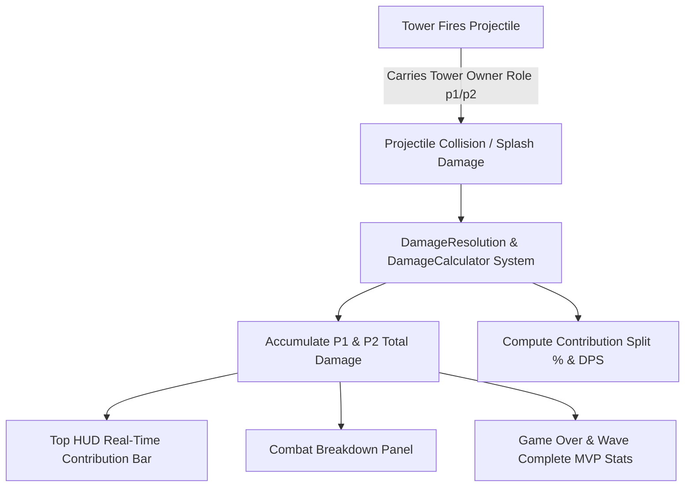

# Feature: Multiplayer Real-Time Damage Calculator & Contribution Metrics

## 1. Summary

In cooperative multiplayer mode, introduce a real-time **Damage Calculator & Combat Contribution System**. This system tracks all direct projectile hits, area-of-effect splash damage, and periodic burn ticks inflicted by towers, attributing every point of damage to either **Player 1 (Host)** or **Player 2 (Guest)** based on tower ownership. 

Players can observe their live cumulative damage, percentage contribution split, and DPS meters during gameplay, as well as review a comprehensive combat performance breakdown upon wave completions and on the game over screen.



---

## 2. Core Feature Requirements

### 2.1. Attribution & Cumulative Damage Tracking
- **Owner Tagging on Attacks:**
  - When a tower fires a projectile, the projectile inherits the tower's `ownerRole` (`'p1' | 'p2'`) and `ownerTag`.
  - On single-target collision, area-of-effect splash detonation, or residual damage, the actual damage dealt to the enemy (accounting for enemy armor/mitigation) is credited to the attacking player.
- **Metrics Tracked per Player:**
  - **Total Accumulated Damage:** Total HP removed from enemies across all waves ($D_{\text{P1}}, D_{\text{P2}}$).
  - **Contribution Percentage:**
    $$\%_{\text{P1}} = \frac{D_{\text{P1}}}{D_{\text{P1}} + D_{\text{P2}}} \times 100\%, \quad \%_{\text{P2}} = \frac{D_{\text{P2}}}{D_{\text{P1}} + D_{\text{P2}}} \times 100\%$$
    *(Defaults to $50\% / 50\%$ before any damage is dealt).*
  - **Current Wave Damage:** Damage dealt specifically during the active wave.
  - **Enemy Kills Count:** Number of final fatal blows delivered by each player's towers.
  - **Archetype Breakdown:** Damage contribution partitioned by tower archetype (`archer`, `cannon`, `sniper`, `ice`, `flamethrower`).

### 2.2. In-Game HUD & Visual Presentation
- **Dual Damage Contribution Bar (Top HUD):**
  - Integrated into the multiplayer top HUD bar beneath the player meters.
  - A dual-colored segmented progress bar:
    - **P1 Segment:** Neon Cyan (`#00E5FF`)
    - **P2 Segment:** Neon Magenta (`#FF007F`)
  - Displays live numeric labels:
    - `[P1] ACE999: 14,250 DMG (58%)`
    - `[P2] NOVA01: 10,320 DMG (42%)`
- **Expandable Combat Metrics Modal / Overlay:**
  - A dedicated **DAMAGE STATS** button (or hotkey `D`) opens an interactive canvas dialog showing:
    - Side-by-side player comparisons (Total Damage, Wave Damage, Kills, Gold Earned, Most Damaging Tower).
    - Horizontal bar charts broken down by tower type.

### 2.3. End-of-Wave & Game Over Recap
- **Wave Complete Summary:**
  - Displays the MVP badge (`★ WAVE MVP: [GAMERTAG]`) on the wave completion banner for the player who dealt the highest damage during that wave.
- **Game Over Combat Report:**
  - The multiplayer Game Over screen is enhanced with a comprehensive post-match report card:
    - Total Match Damage for Player 1 and Player 2.
    - Match MVP crowning based on total damage dealt.
    - Total Kills and Economy stats per player.

---

## 3. Technical Architecture

### 3.1. Data Models (`src/types.ts`)
```typescript
export interface PlayerCombatStats {
  totalDamage: number;
  waveDamage: number;
  kills: number;
  damageByTowerType: Record<TowerType, number>;
}

export interface MultiplayerCombatState {
  p1: PlayerCombatStats;
  p2: PlayerCombatStats;
}
```

### 3.2. Damage Calculator System (`src/system/DamageCalculator.ts`)
- A dedicated subsystem class responsible for:
  - Recording damage transactions: `recordDamage(role: PlayerRole, amount: number, towerType: TowerType): void`.
  - Recording kills: `recordKill(role: PlayerRole): void`.
  - Computing split percentages: `getContributionSplit(): { p1Percent: number; p2Percent: number }`.
  - Resetting wave metrics on wave transitions: `resetWaveStats(): void`.
  - Providing serializable state snapshots for network synchronization.

### 3.3. Projectile & Collision Integration (`src/entities/Projectile.ts` & `src/main.ts`)
- Pass `ownerRole?: PlayerRole` into `Projectile` initialization.
- In `Game.updateSimulation()`, whenever collision damage or splash damage is applied to an enemy via `enemy.takeDamage(amount)`:
  - Retrieve the net HP lost by the enemy.
  - Dispatch `damageCalculator.recordDamage(projectile.ownerRole, actualDamageDealt, projectile.towerType)`.
  - If `!enemy.alive`, dispatch `damageCalculator.recordKill(projectile.ownerRole)`.

### 3.4. UI & HUD Integration (`src/ui/UIManager.ts`)
- Render the dual damage bar and numeric metrics in `render()` when in multiplayer mode.
- Render the expandable Damage Stats modal (`renderDamageStatsModal()`).
- Display combat recap statistics on the Game Over screen.

---

## 4. Implementation Task Breakdown

The implementation is tracked under **Task 31**:
- **[Task 31: Multiplayer Damage Calculator & Combat Stats System](docs/tasks/task-31-multiplayer-damage-calculator.md)**
  - Subtask 31.1: Data types and `DamageCalculator` class implementation.
  - Subtask 31.2: Projectile owner role propagation and damage attribution hooks.
  - Subtask 31.3: Top HUD contribution bar and live damage stats rendering.
  - Subtask 31.4: Detailed Combat Stats modal and Game Over breakdown UI.
  - Subtask 31.5: Automated Playwright tests for damage calculation and multi-client sync.

---

## 5. Acceptance Criteria

1. **Attribution Accuracy:**
   - Damage dealt by Player 1's towers is 100% credited to Player 1.
   - Damage dealt by Player 2's towers is 100% credited to Player 2.
   - Splash damage from cannons/projectiles accurately credits the projectile's owner for all affected enemies.
2. **HUD & Visual Metrics:**
   - Top HUD bar displays real-time total damage numbers and contribution percentages for both players with smooth visual updates.
   - Color coding aligns with Player 1 (Cyan `#00E5FF`) and Player 2 (Magenta `#FF007F`).
3. **End-of-Wave & Game Over:**
   - Wave clear banners highlight the wave damage leader.
   - Game Over screen displays the final damage comparison and MVP badge.
4. **Automated Tests:**
   - Playwright test suites verify damage incrementation, percentage splits, and UI components across single-player and multiplayer sessions.
