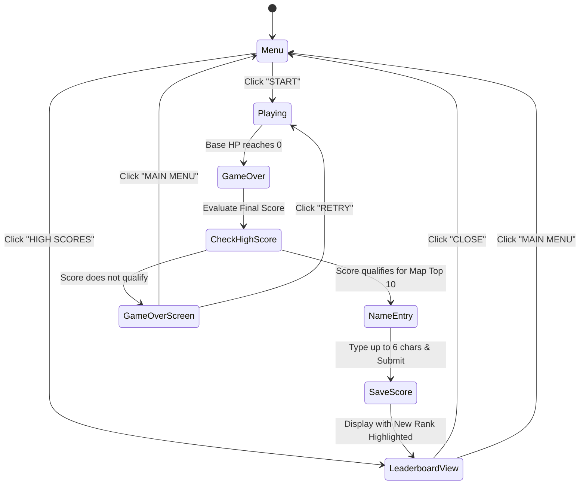

# Feature: Persisted High Scores & Map-Specific Leaderboards

## Summary

Add persistent high score tracking and leaderboards to AI Tower Defence. Each map (`space`, `dungeon`, `military`) maintains an independent leaderboard stored across browser sessions via `localStorage`. When a game ends, if the player's final score qualifies for the map's leaderboard, they are presented with an arcade-style high score entry screen allowing a custom name of up to 6 characters before their score is saved and ranked.

---

## Key Feature Requirements

### 1. Isolated Leaderboards per Map
- High scores are tracked separately for each map environment:
  - **Space Station** Leaderboard
  - **Dungeon Catacombs** Leaderboard
  - **Military Outpost** Leaderboard
- Runs on one map do not affect or mix with rankings on another map.
- Each leaderboard retains the **Top 10** scores for that map, sorted in descending order of final score (with ties broken by wave reached, then oldest entry).

### 2. Persistent Local Storage
- Leaderboard data persists across browser reloads and closed sessions using `localStorage` (storage key: `td_highscores`).
- Robust fallback and error handling:
  - Gracefully handles disabled or unavailable `localStorage` (e.g., private browsing storage restrictions).
  - Validates and sanitizes stored data against schema corruption.
  - Seeds default/placeholder entries or initializes clean empty leaderboards on first launch.

### 3. High Score Name Entry (Up to 6 Letters)
- When a game concludes (`gameOver`), the system checks if the final score qualifies for the active map's top 10 (or if the leaderboard has fewer than 10 entries and score > 0).
- If qualified, an **Arcade Name Entry Modal** is displayed:
  - Players can input a name between **1 and 6 characters** (alphanumeric `A-Z`, `0-9`, auto-uppercased).
  - Supports keyboard typing (`A-Z`, `0-9`), `Backspace` / `Delete` to remove characters, and `Enter` to submit.
  - Interactive canvas UI features 6 retro arcade letter slot boxes with a blinking cursor indicator and an on-screen **SUBMIT** button.
  - Trims trailing whitespace; defaults to a fallback tag (e.g., `ACE` or `PLAYER`) if submitted empty.
- Once submitted, the entry is persisted, and the player is navigated to the map's leaderboard view with their new record highlighted.

### 4. Leaderboard Viewer UI
- **Main Menu Access:** A dedicated **HIGH SCORES** button on the main menu opens the leaderboard overlay.
- **Game Over Integration:** A **LEADERBOARD** button on the Game Over screen allows reviewing top scores after a run.
- **Map Tabs:** Interactive tab switches at the top of the leaderboard modal allow switching between **Space Station**, **Dungeon Catacombs**, and **Military Outpost** scores.
- **Entry Details Displayed:**
  - Rank badge (`#1` to `#10`, with gold/silver/bronze styling for top 3)
  - Player Name (up to 6 uppercase letters)
  - Final Score
  - Wave Reached
  - Difficulty Mode (`Easy`, `Medium`, `Hard`)
  - Date / Timestamp (e.g. `YYYY-MM-DD`)
- **Clear / Reset Option:** An option or test utility to reset leaderboards.

---

## User Flow & State Transitions



---

## Technical Architecture & Design

### 1. Domain Types (`src/types.ts`)

```typescript
export interface HighScoreEntry {
  id: string;
  name: string; // 1-6 characters, uppercase alphanumeric
  score: number;
  wave: number;
  difficulty: DifficultyMode;
  mapType: MapType;
  timestamp: number; // Unix timestamp in milliseconds
}

export type Leaderboards = Record<MapType, HighScoreEntry[]>;
```

### 2. High Score System (`src/system/HighScoreSystem.ts`)

A dedicated service managing persistence, validation, sorting, and ranking logic:

```typescript
export class HighScoreSystem {
  private static readonly STORAGE_KEY = 'td_highscores';
  private static readonly MAX_ENTRIES_PER_MAP = 10;
  private static readonly MAX_NAME_LENGTH = 6;

  private leaderboards: Leaderboards;

  constructor() {
    this.leaderboards = this.loadScores();
  }

  /** Checks if a score qualifies for the top 10 on a specific map */
  isHighScore(mapType: MapType, score: number): boolean;

  /** Inserts a new high score entry, maintains sort order, and trims beyond top 10 */
  addScore(
    mapType: MapType,
    name: string,
    score: number,
    wave: number,
    difficulty: DifficultyMode
  ): HighScoreEntry;

  /** Gets sorted top entries for a given map */
  getScores(mapType: MapType): HighScoreEntry[];

  /** Serializes current leaderboards to localStorage */
  private saveScores(): void;

  /** Deserializes leaderboards from localStorage with fallback defaults */
  private loadScores(): Leaderboards;

  /** Clears scores for a specific map or all maps */
  clearScores(mapType?: MapType): void;
}
```

### 3. Name Entry & Input Handling (`src/ui/UIManager.ts`)

- **State Management:**
  - `showHighScoreEntry: boolean`
  - `highScoreNameInput: string` (buffer clamped to max 6 characters)
  - `showLeaderboardModal: boolean`
  - `activeLeaderboardTab: MapType`
  - `lastInsertedEntryId: string | null` (used to pulse or highlight the player's new rank)
- **Event Handling:**
  - `keydown` listener active during high score entry:
    - Letters `[A-Za-z0-9]`: Appends uppercase character if `length < 6`.
    - `Backspace`: Removes last character.
    - `Enter`: Submits the current name buffer.
  - Click hitboxes for canvas on-screen buttons (character slots, backspace icon, submit button, map tab pills, close button).

### 4. Game Orchestration Integration (`src/main.ts`)

- Instantiate `highScoreSystem = new HighScoreSystem()`.
- On `gameOver()`:
  - If `highScoreSystem.isHighScore(this.activeMap, this.gameData.score)`, transition UI to high score entry mode.
  - Provide callbacks between `UIManager` and `HighScoreSystem`:
    - `uiManager.onCheckHighScore = (score, map) => highScoreSystem.isHighScore(map, score)`
    - `uiManager.onSubmitHighScore = (name) => highScoreSystem.addScore(...)`
    - `uiManager.onGetLeaderboard = (map) => highScoreSystem.getScores(map)`
- Expose `(window as any).highScoreSystem` for automated test verification and debugging.

### 5. Audio Integration (`src/audio/AudioManager.ts`)

- Add high score audio events:
  - `highScoreFanfare`: Celebratory synth arpeggio when qualifying for a new high score.
  - `scoreSubmit`: Confirmation chime when locking in name and saving to leaderboard.

---

## Canvas Visual Layout & UI Mockups

### High Score Name Entry Screen (Modal / Overlay)
```
+-------------------------------------------------------------+
|                      ★ NEW HIGH SCORE! ★                     |
|                 MAP: SPACE STATION  -  SCORE: 4,850          |
|                                                             |
|                    ENTER YOUR NAME (MAX 6)                  |
|                                                             |
|                   [ A ] [ C ] [ E ] [ _ ] [   ] [   ]       |
|                                                             |
|                     [ SUBMIT HIGH SCORE ]                   |
+-------------------------------------------------------------+
```

### Leaderboard Viewer Modal
```
+-------------------------------------------------------------+
|                      LEADERBOARDS                           |
|       [ SPACE STATION ]  [ DUNGEON ]  [ MILITARY ]          |
|-------------------------------------------------------------|
| RANK   NAME     SCORE    WAVE    DIFFICULTY    DATE         |
|  #1    CYBER    12,450    28       HARD      2026-09-01     |
|  #2    NOVA      9,200    22      MEDIUM     2026-09-02     |
|  #3    ACE       4,850    15       EASY      2026-09-03     |
|  #4    ...        ...     ..        ..           ..         |
|-------------------------------------------------------------|
|                          [ CLOSE ]                          |
+-------------------------------------------------------------+
```

---

## Test & Acceptance Criteria

1. **Map Isolation:**
   - Earning a high score on the `dungeon` map only appears under the Dungeon Catacombs leaderboard, leaving `space` and `military` leaderboards untouched.
2. **Name Constraint Validation:**
   - Input is strictly limited to 1–6 characters.
   - Non-alphanumeric symbols are filtered out; lowercase letters are automatically capitalized.
3. **Ranking & Sorting Accuracy:**
   - Entries are sorted primarily by score descending.
   - Leaderboards correctly truncate to the top 10 entries when an 11th score is introduced.
4. **Persistence:**
   - Reloading the page retains all previously submitted high scores from `localStorage`.
   - Modifying storage with corrupted data recovers gracefully without crashing the game loop.
5. **UI & Keyboard Controls:**
   - Keyboard typing and backspace update the on-screen letter slots in real time.
   - Pressing Enter or clicking Submit commits the score and shows the updated table.
6. **Automated Testing:**
   - Playwright E2E suite (`tests/ui/leaderboards.spec.ts`) verifies score qualification checks, name input truncation, map tab switching, and persistence across page reloads.
