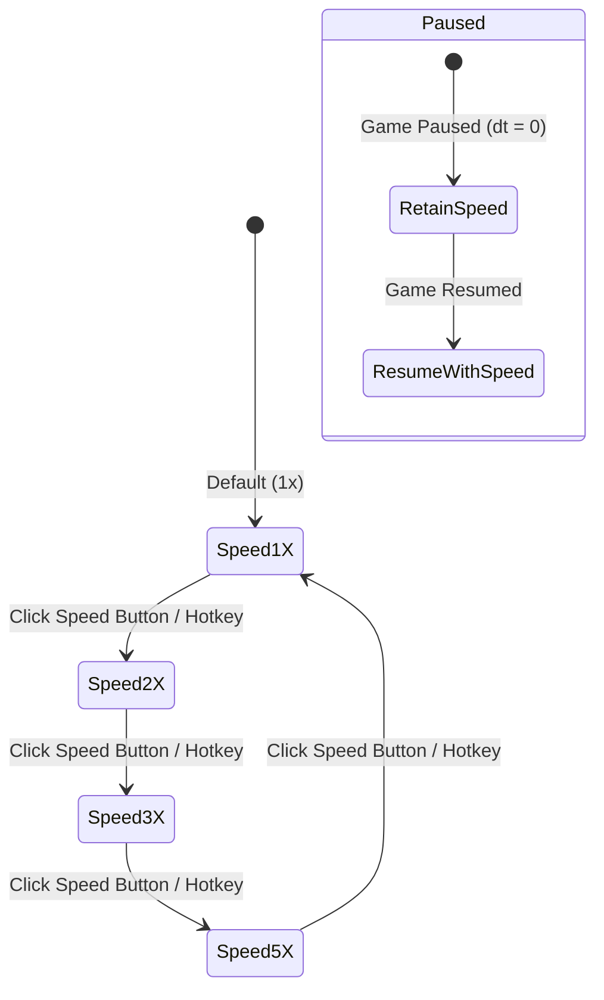

# Feature: Variable Game Speed Controls (1x, 2x, 3x, 5x)

## Summary

Add real-time game speed controls to AI Tower Defence, allowing players to dynamically accelerate gameplay through four distinct speed multipliers: **1x (Normal)**, **2x (Fast)**, **3x (Very Fast)**, and **5x (Hyper / Turbo)**. This allows players to fast-forward through early waves, accelerate farming, or quickly test defensive strategies while preserving simulation accuracy, smooth rendering, and responsive UI interaction.

---

## Key Feature Requirements

### 1. Supported Speed Multipliers
- **1x (Standard Speed):** Base simulation speed ($\Delta t \times 1.0$).
- **2x (Double Speed):** $2.0\times$ simulation rate for brisk early-wave pacing.
- **3x (Triple Speed):** $3.0\times$ simulation rate for streamlined mid-game wave progression.
- **5x (Hyper / Turbo Speed):** $5.0\times$ simulation rate for high-speed late-game endurance runs and rapid testing.

### 2. Simulation Integrity & Fixed Sub-Stepping
- Accelerated delta times ($\Delta t_{\text{effective}} = \Delta t_{\text{frame}} \times \text{Speed}$) can lead to discrete collision tunnelling or waypoint overshoot if applied in a single massive step.
- The engine must adopt **sub-stepped physics integration**:
  - For speeds $\ge 2\times$, the accumulated effective delta time is resolved in fixed sub-steps (e.g. maximum step size of $\Delta t_{\text{sub}} \le 0.033\text{s}$).
  - Ensures laser/arrow projectile collision checks, splash damage radii, and enemy waypoint corner navigation remain $100\%$ accurate and deterministic at 5x speed.

### 3. User Interface & Controls
- **HUD Speed Toggle Button:**
  - Located on the bottom control dock alongside Pause (`⏸`) and Reset (`RESET`), or integrated directly into the top HUD.
  - Interactive multi-state cycle button or segmented pill button displaying the active speed:
    - `[ 1X ]` (Default cyan / white)
    - `[ 2X ]` (Green neon)
    - `[ 3X ]` (Amber gold)
    - `[ 5X ]` (Hyper magenta / neon violet with active pulse)
  - Clicking cycles sequentially: $1\text{x} \rightarrow 2\text{x} \rightarrow 3\text{x} \rightarrow 5\text{x} \rightarrow 1\text{x}$.
- **Keyboard Shortcuts:**
  - `Space` or `Tab` / `~` (tilde): Cycle to next speed setting.
  - Dedicated numeric shortcuts or hotkeys (e.g., `[` and `]` or hotkeys) to adjust speed up/down.
- **State Behavior:**
  - Speed controls are active during `'playing'` and `'waveComplete'` states.
  - When the game is `'paused'`, the selected speed setting is preserved and takes effect immediately upon resuming.
  - Resetting to the menu or starting a new game retains or resets to default 1x based on user preference.

### 4. Audio & Visual Adaptation
- **Background Music (BGM):** Procedural synthwave music continues playing at comfortable listening tempo (unaltered pitch and rhythm) to preserve acoustic quality.
- **Sound Effects (SFX):** SFX playback throttling/debouncing ensures dense multi-kill events at 5x speed do not cause audio clipping or buffer saturation.
- **Visuals:** Projectile trails, particle bursts, and floating damage numbers smoothly scale with simulation time.

---

## User Flow & Interaction State Diagram



---

## Technical Architecture & Design

### 1. Types (`src/types.ts`)

```typescript
export type GameSpeed = 1 | 2 | 3 | 5;

export const AVAILABLE_GAME_SPEEDS: readonly GameSpeed[] = [1, 2, 3, 5] as const;
```

### 2. Game Loop & Sub-Stepping Architecture (`src/engine/GameLoop.ts` / `src/main.ts`)

```typescript
class Game {
  private gameSpeed: GameSpeed = 1;
  private static readonly MAX_SUB_STEP_DT = 0.033; // 30ms max per physics tick

  public setGameSpeed(speed: GameSpeed): void {
    this.gameSpeed = speed;
  }

  public getGameSpeed(): GameSpeed {
    return this.gameSpeed;
  }

  public cycleGameSpeed(): GameSpeed {
    const speeds: GameSpeed[] = [1, 2, 3, 5];
    const nextIdx = (speeds.indexOf(this.gameSpeed) + 1) % speeds.length;
    this.gameSpeed = speeds[nextIdx];
    return this.gameSpeed;
  }

  private update(dt: number): void {
    if (this.gameState !== 'playing') return;

    // Apply speed multiplier with sub-stepping for simulation stability
    const totalDt = dt * this.gameSpeed;
    let remainingDt = totalDt;

    while (remainingDt > 0) {
      const stepDt = Math.min(remainingDt, Game.MAX_SUB_STEP_DT);
      this.tickSimulation(stepDt);
      remainingDt -= stepDt;
    }
  }

  private tickSimulation(dt: number): void {
    // Economy, wave spawning, enemy movement, tower firing, collisions, effects
  }
}
```

### 3. UI Manager Integration (`src/ui/UIManager.ts`)

- **State:**
  - `gameSpeed: GameSpeed = 1;`
- **Callbacks:**
  - `onSetGameSpeed?: (speed: GameSpeed) => void;`
  - `onCycleGameSpeed?: () => GameSpeed;`
- **Canvas Rendering:**
  - Renders speed control badge next to the pause/reset buttons on the bottom control bar during active gameplay.
  - Highlights active speed with color accents:
    - `1X`: `#7EC8FF` (Cyan)
    - `2X`: `#56D364` (Green)
    - `3X`: `#FFD700` (Gold)
    - `5X`: `#FF55FF` (Hyper Magenta)
- **Hit Detection:**
  - `getSpeedButtonRect()` registers clicks on the speed button and invokes `cycleGameSpeed()`.

---

## Test & Acceptance Criteria

1. **Speed Cycling:**
   - Clicking the speed button cycles accurately through `1x` $\rightarrow$ `2x` $\rightarrow$ `3x` $\rightarrow$ `5x` $\rightarrow$ `1x`.
   - Keyboard hotkey cycles speeds as expected.
2. **Simulation Fidelity at 5x:**
   - Fast and regenerating enemies navigate path corners without skipping waypoints or clipping through walls.
   - Towers fire at expected proportional rates ($5\times$ projectiles per wall-clock second).
   - Collision checks detect projectile hits reliably without bullet-through-paper tunnelling.
3. **Pause & Resume Compatibility:**
   - Pausing stops all movement regardless of the current speed setting.
   - Resuming immediately restores the active speed multiplier.
4. **Performance:**
   - Frame rates remain at a stable 60 FPS under 5x speed without thread locking or garbage collection stutter.
5. **Automated Playwright Tests:**
   - Test suite verifies speed button rendering, cycling behavior, game state introspection, and accelerated wave completion times.
